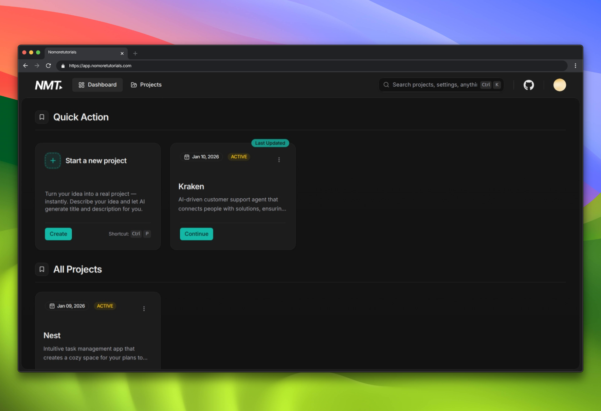

# NoMoreTutorials

<div align="left">
  <p><em> An AI-powered platform that guides beginner and intermediate developers out of "tutorial hell" by
providing personalized, mentor-style step-by-step instructions to build real, production-grade projects from scratch.</em></p>




[Try NoMoreTutorials Live](https://app.nomoretutorials.com)

</div>

---

## ✨ What is NoMoreTutorials?

NoMoreTutorials is an AI-powered platform that revolutionizes how developers learn and build projects. Instead of endless tutorial videos, we provide:

- **🎯 Idea-to-Plan Conversion**: Transform your project ideas into structured, actionable development plans
- **🤖 AI-Generated Features & Steps**: Get intelligent project breakdowns with just-in-time learning
- **📚 Active Learning Approach**: Receive hints and guidance instead of complete solutions
- **⚡ Just-in-Time Tech Introduction**: Learn tools only when your project actually needs them

## 🛠️ Tech Stack

### Frontend

- **Framework**: Next.js 16 with App Router
- **Language**: TypeScript
- **Styling**: Tailwind CSS with Radix UI components
- **State Management**: Zustand
- **Animations**: Framer Motion
- **Icons**: Lucide React & Tabler Icons

### Backend & Database

- **Database**: PostgreSQL with Prisma ORM
- **Authentication**: Better Auth
- **AI Integration**: OpenAI GPT models via Vercel AI SDK
- **Caching**: Upstash Redis
- **Email**: Resend
- **Background Jobs**: Inngest

### DevOps & Tools

- **Deployment**: Vercel
- **Package Manager**: bun

## 📋 Prerequisites

Before running this application, make sure you have:

- **Node.js** 18+ and npm/pnpm
- **PostgreSQL** database (local or cloud)
- **OpenAI API** account and key
- **Redis** instance (for caching, optional for development)

## 📖 Usage

### Creating Your First Project

1. **Sign Up/Login**: Create an account or sign in with your preferred provider
2. **Complete Onboarding**: Tell us about your experience level and preferred tech stacks
3. **Create a Project**: Describe your project idea in natural language
4. **AI Analysis**: Our AI breaks down your idea into features and implementation steps
5. **Start Building**: Follow the guided steps to build your project

## 🏗️ Project Structure

```
src/
├── app/                    # Next.js App Router pages
│   ├── (dashboard)/       # Protected dashboard routes
│   ├── api/               # API routes
│   ├── auth/              # Authentication pages
│   ├── onboarding/        # User onboarding flow
│   └── project/           # Project-specific pages
├── components/            # Reusable UI components
├── hooks/                 # Custom React hooks
├── lib/                   # Utility libraries and configurations
├── store/                 # Zustand state management
├── types/                 # TypeScript type definitions
└── utils/                 # Helper functions
```

## License

This project is licensed under the [MIT License](./LICENSE).

**Attribution:** Use of this code **requires** clear credit to **NoMoreTutorials** and a link back to this repository.
